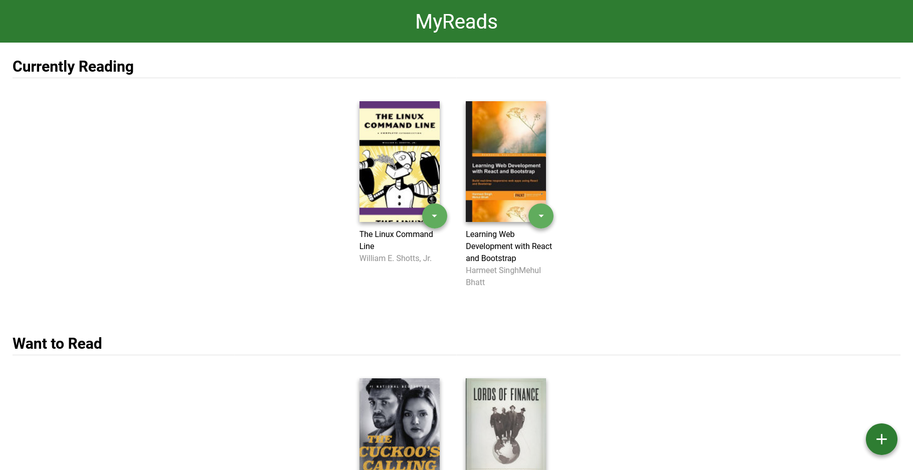

## myReads App


- Author : Yossef Alatter
- [Demo](https://my-read-app-two.vercel.app/) 

---
## Description

This is myReads App to help user keep track with his books as it provides following:
  - organised books in three shelves (Currently Reading, Want To Read, Read)
  - make it easy to move books from one shelf to another
  - add new books to these shelves
  - search about books by their name or author name

---
## Needed Software 

you must have according software
- text editor
- browser
- node.js
- npm
- git 

--- 
## Installations Steps

 ```
// to clone repo
 git clone https://github.com/yossefAlatter/myRead-app.git
 
 // to move into repo
 cd myRead-app

// to install dependence
 npm install

 // to run project
 npm start
 ```

---
## Project Structure
```
├── public
│   ├── index.html
│   └── read.png
└── src
    ├── components
    │   └── Book.js
    ├── icons 
    │   ├── add.svg
    │   ├── arrow-back.svg
    │   └── arrow-drop-down.svg
    ├── views
    │   ├── Home.js
    │   └── Search.js
    ├── App.css 
    ├── App.js 
    ├── App.test.js
    ├── BooksAPI.js 
    ├── index.css 
    └── index.js 
├── .gitignore
├── CONTRIBUTING.md
├── package-lock.json
├── package.json
├── README.md 
├── SEARCH_TERMS.md 
├── yarn.lock
```